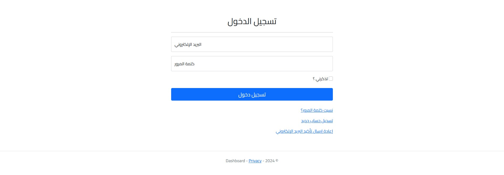
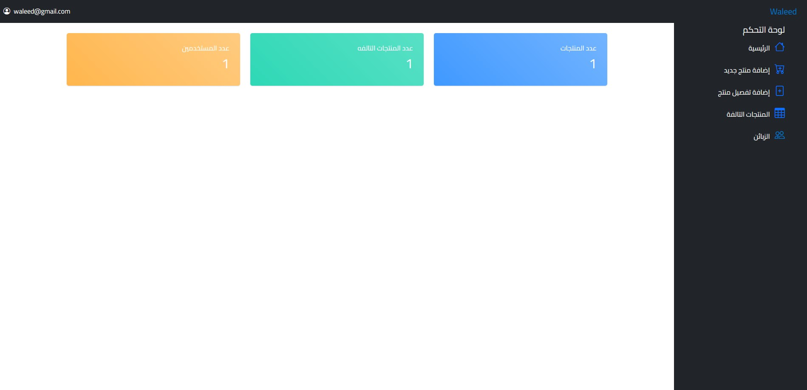
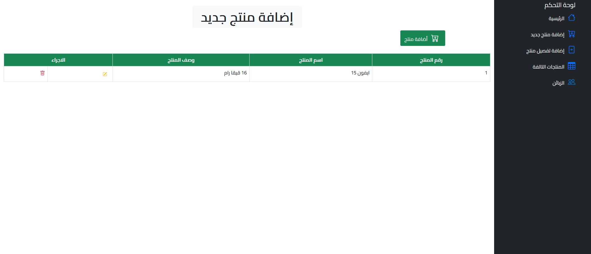
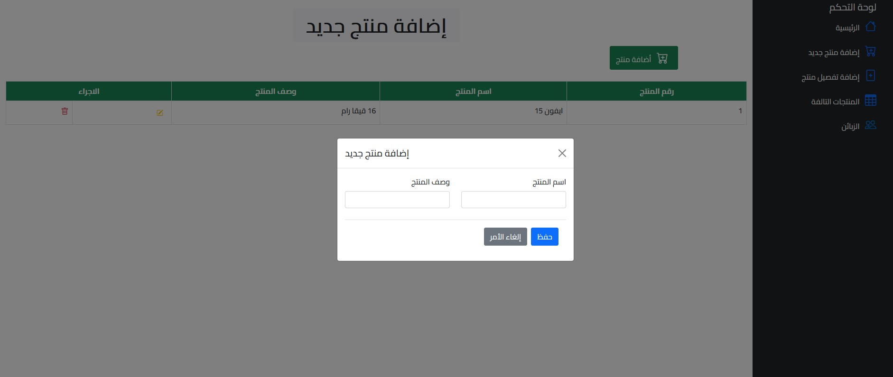
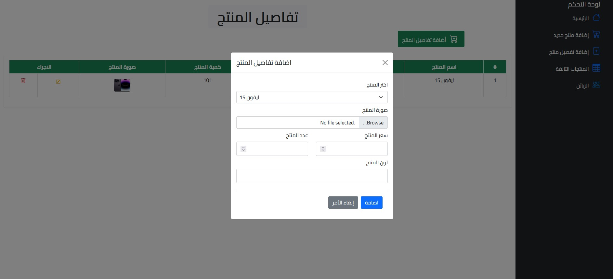
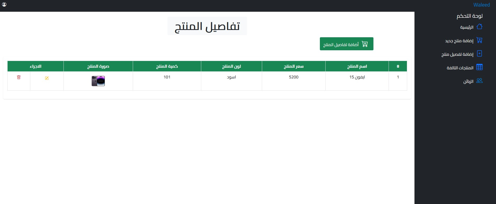
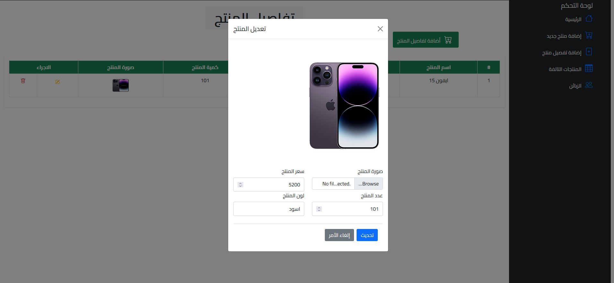
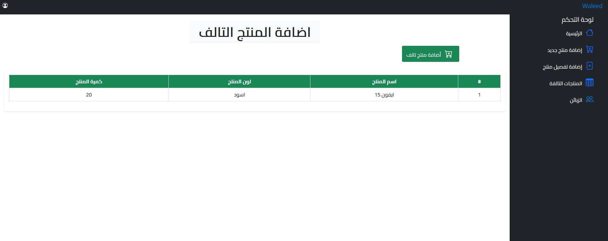

# Dashboard

Dashboard is a simple web application built with ASP.NET Core MVC. It allows users to manage products, including adding new products, editing existing products, adding damaged products, and managing product details. The application provides a user-friendly interface to handle various product management tasks efficiently.











### Features

- **Add New Products:** Users can add new products to the inventory.
- **Edit Products:** Users can edit the details of existing products.
- **Add Damaged Products:** Users can add products as damaged and manage the details of damaged products.
- **Manage Product Details:** Users can add and edit additional details for each product.

### Technologies Used

- **Backend:** ASP.NET Core MVC, Entity Framework Core
- **Frontend:** HTML, CSS, JavaScript, Bootstrap
- **Database:** SQL Server
- **Authentication:** ASP.NET Core Identity

### Getting Started

#### Prerequisites

- [.NET 8 SDK](https://dotnet.microsoft.com/download/dotnet/8.0)
- [SQL Server](https://www.microsoft.com/en-us/sql-server/sql-server-downloads)
- [Visual Studio](https://visualstudio.microsoft.com/) or any C# IDE

#### Installation

1. **Clone the repository:**

   ```bash
   git clone https://github.com/CaSFoR/Dashboard.git
   cd Dashboard
